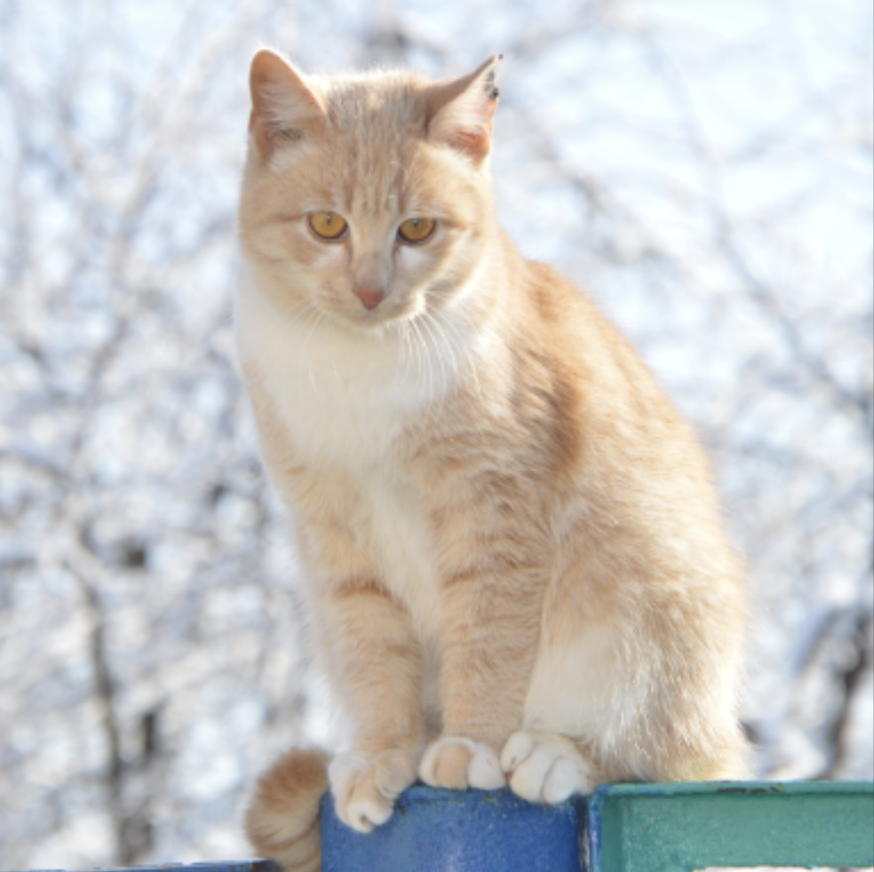

# flux-rf-inversion Cog Model

This is an implementation of [flux-rf-inversion](https://github.com/huggingface/diffusers/pull/9816) as a [Cog](https://github.com/replicate/cog) model.

## Development

Follow the [model pushing guide](https://replicate.com/docs/guides/push-a-model) to push your own model to [Replicate](https://replicate.com).

## How to use

Make sure you have [cog](https://github.com/replicate/cog) installed.

To run a prediction:

    cog predict -i image=@cat.png -i prompt="Portrait of a tiger"

<table> <tr> <td></td> <td></td> </tr> </table>